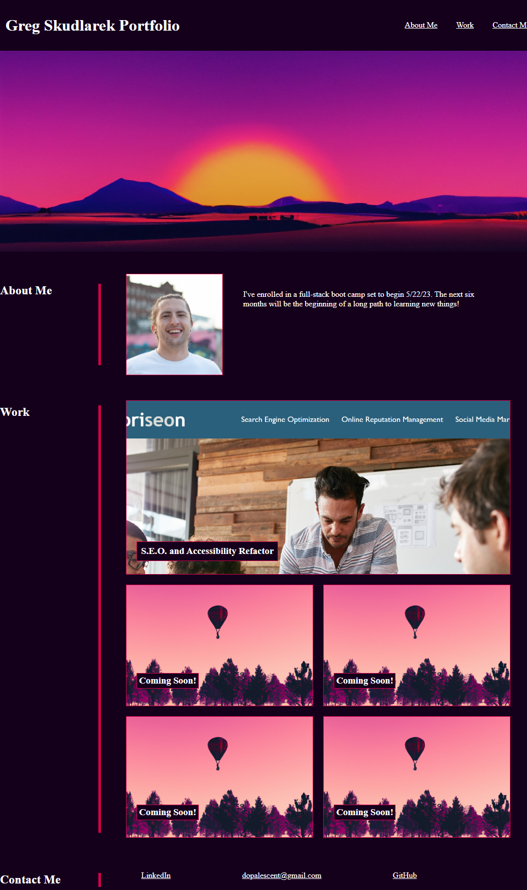

# <Challenge 2: Professional Portfolio>

## Description

- In this project, we created a webpage to act as a professional portfolio for showcasing our development capabilities.
- Completing this project required building and styling a webpage with no starter code.
- Positioning of elements required a competent understanding of element nesting, display boxes, and flexbox attributes.
- The finished product met parameters such that design elements remained coherent on a full spectrum of device viewports.
- In all, this project allowed me to demonstrate an advanced understanding of CSS styling and responsive layouts.

## Usage

- At time of publication, the project can be found deployed at https://dopalescent.github.io/Portfolio/

- The following screenshot previews the deployed project:

## Credits

- Penn LPS Boot Camp program for education and resources
- DigitalOcean and CSS-Tricks for their article, 'A Complete Guide to Flexbox.'
- EdX and The Full-Stack Blog for their 'Professional README Guide' article.